# GAMEBOX
(Developer: Matej Car)

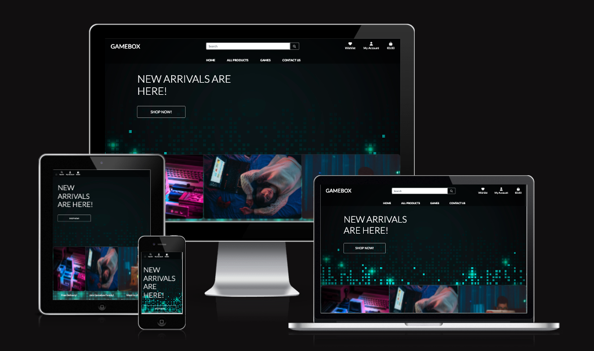

[View live website](https://ci-pp5-gamebox-7df162bca61b.herokuapp.com/)

## Table of Contents
0. [About](#about)
1. [Project Goals](#project-goals)
    1. [User Goals](#user-goals)
2. [User Experience](#user-experience)
    1. [Target Audience](#target-audience)
    2. [User Requirements and Expectations](#user-requirements-and-expectations)
    3. [User Stories](#user-stories)
    4. [Site Owner Stories](#site-owner-stories)
3. [Design](#design)
    1. [Colours](#colours)
    2. [Fonts](#fonts)
    3. [Project Structure](#project-structure)
    4. [Database](#database)
    5. [Data Models](#data-models)
    6. [Wireframes](#wireframes)
    7. [Agile Design](#agile-design)
4. [Technologies Used](#technologies-used)
    1. [Languages & Frameworks](#languages--frameworks)
    2. [Libraries and Tools](#libraries--tools)
5. [Features](#features)
6. [Future Features](#future-features)

7. [Validation](#validation)
    1. [CSS](#css)
    2. [Html](#html)
    3. [Javascript](#javascript)
    4. [Python](#python)
    5. [Chrome Dev Tools Lighthouse](#lighthouse)
    6. [WAVE Validation](#wave)
8. [Testing](#testing)

9. [Bugs](#bugs)

10. [Deployment](#deployment)
    1. [Heroku](#heroku)
    2. [Forking GitHub Repo](#forking-the-github-repository)
    3. [Clone a GitHub Repo](#clone-a-github-repository)
12. [Credits](#credits)
    1. [Code](#code)
    2. [Tutorials](#tutorials)
    3. [Imagery](#imagery)
13. [Acknowledgements](#acknowledgements)

## About

Gamebox is a Django full stack e-commerce app for purposes of Project Portfolio 5 with Code Institute. Gamebox is a fictional e-commerce site which provides gamers with a selection of video games for different consoles. 
***
## Project Goals

- To offer users purchase of products listed on a web-store.
- To allow site owner to add, edit and remove products.
- To give users a great user experience while visiting a web-store.
- To give users option for buying as a guest or a registered user.
- To give users option to contact site owner as a guest or registered user.
- To allow user creating or updating an account.
- To give users option to check the order history.
- To give users option to add,edit and delete a product review.
- To give users option to add and remove products to a wishlist.
- To give users option to signup for newsletter.

### User Goals

- View and search for products.
- Filter products based on criteria.
- Register and log into/out of an account.
- View and edit account profile.
- Add products to the shopping bag and make purchases.
- View order history.
- Write, edit, and delete product reviews.
- Create and manage a wishlist.
- Contact the site owner or customer support.
- Sign up for a newsletter.

## Business Model
***

Gamebox project was developed out of want to help passionate gamer community to easier find new and cheap video games and in future the consoles as well.

- Value Proposition:
    - Offer a curated selection of most popular video games.
    - Make video games more accessible to a broader range of customers who appreciate gaming and quality of the products.

- Target market:
    - Gamers of all ages.
    - Individuals seeking high-quality services for personal use or gifts.

- Customer Relationships:
    - Engage with customers through social media, email newsletters, and personalized communications to foster brand loyalty.
    -  Encourage customer feedback and reviews to continuously improve the product selection and overall shopping experience.

- Communication channels:
    - E-commerce website: Provide a user-friendly online platform where customers can browse, select, and purchase video games.
    - Social media platforms: Utilize platform as Facebook to engage with the audience, and drive traffic to the web-shop.

### SEO

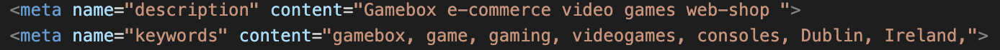

### Marketing

#### Facebook business page
- To assist with marketing the website and further boost its visibility, I have included a link to the web-shop's own Facebook Business Page in the footer section. This reciprocal link establishes a connection between the website and its social media presence, allowing visitors to easily access the Facebook page for additional updates, promotions, and engagement with the brand.

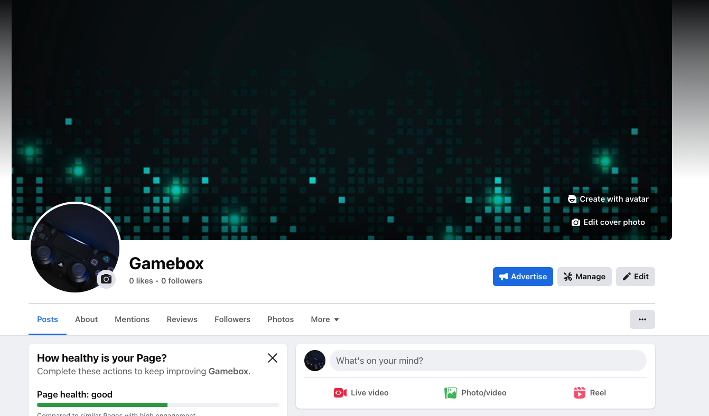
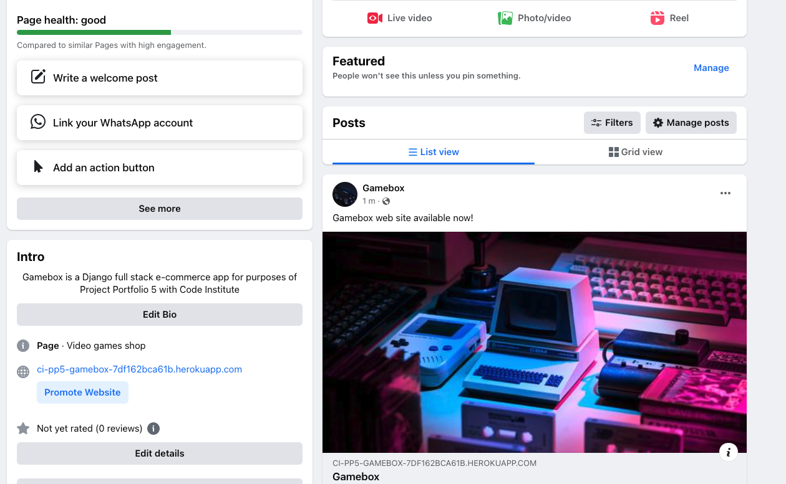

### Target audience

- Video game enthusiasts.
- Individuals seeking new and popular video games for personal use or gifts.

##### Back to [top](#table-of-contents)

## User Experience

##### Back to [top](#table-of-contents)

### User stories

## Unregistered User

1. As an unregistred user, I want to be able to view a list of products so that I can select some to purchase
2. As an unregistred user, I want to be able to view product details so that I can identify the price, description, rating and image
3. As an unregistred user, I want to be able to view total of my purchases at any time so that I am aware of how much I am spending
4. As an unregistred user, I want to be able to register for an account so that I have a personal account and can view my profile
5. As an unregistred user, I want to be able to view products by categories so that I can find products in specific category
6. As an unregistred user, I want to be able to add products that i wish to buy to shopping bag so that I can continue shopping
6. As a unregistered user I can sort products so that I can optimize my products view
7. As an unregistered user I can easily see what I have searched and the number of results so that I can quickly decide whether the products I want are available
8. As an unregistered user I can see messages on different pages so that I am aware of the success or failure of my actions
9. 
10. As a unregistered I can contact the site owner so that I can get in touch with the site owner.
11. As an unregistred user, I want to be able to view my shopping bag and edit quanity of products so I can add more or remove products from my shopping bag
12. As an unregistred user, I want to be able to search for products by name or description so that I can find a specific product I would like to purchase
13. As an unregistred user, I want to be able to easily see what I have searched and number of results so that I can quickly decide whether the products I want is available
14. As an unregistred user, I want to be able to pick the console for games so that I can purchase a game for certain console
15. As an unregistred user, I want to be able to easily enter my payment information so that I can check out quickly
16. As an unregistred user, I want to be able to view an order confirmation after checkout so that I can verify that I haven't made any mistakes
17. As an unregistred user, I want to be able to receive an email confirmation of order after checkout so that I can keep the information for my records

## Registered User

18. As a registered user, I want to be able to login or logout so that I can access my account information
19. As a registered user I can view my wishlist so that I can see and access products that are on my wishlist
20. As a registered user I can add products to my wishlist so that I can access them easier once I decide to buy
21. As a registered user I can leave a review on products so that I can give feedback regarding products I purchased
22. As a registered user I can edit my review on products so that I can update my review
23. As a registered user I can delete my review on products so that my review is not visible anymore
24. As a registered user, I want to be able to recover my password so that I can recover access to my account
25. As a registered user, I want to be able to receive an email confirmation after registering so that I can verify my account
26. As a registered user I can remove products from my wishlist so that I can remove unwanted products from my wishlist
27. As a registered user, I want to be able to have a personalized user profile so that I can view my personal order history and other info
28. As a registered user, I want to be able to to save my payment information so that I can my future purchases are faster
29. As a registered user I can recover my password so that I can recover access to my account
30. As a registered user, I want to be able to edit my profile info so that I can update my profile
31. As a registered user, I want to be able to delete my profile so that my profile does not exist on site anymore

## Site Owner 

32. As a site owner, I want to be able to add a product so that I can add new items to my store
33. As a site owner, I want to be able to edit/update a product so that I can change prices, description, image and other
34. As a site owner, I want to be able to delete a product so that I can remove items that are no longer available
24. As a site owner, I want to be able to edit/remove reviews so that I can manage content on my web site.

## Design
***
### Colours
In this project colour pallete is very simple. Creating a visually appealing and user-friendly experience. The use of dark background picture, black coloured footer and header with white text and elements provide a perfect balance showcasing the products effectively and providing an enjoyable browsing experience.

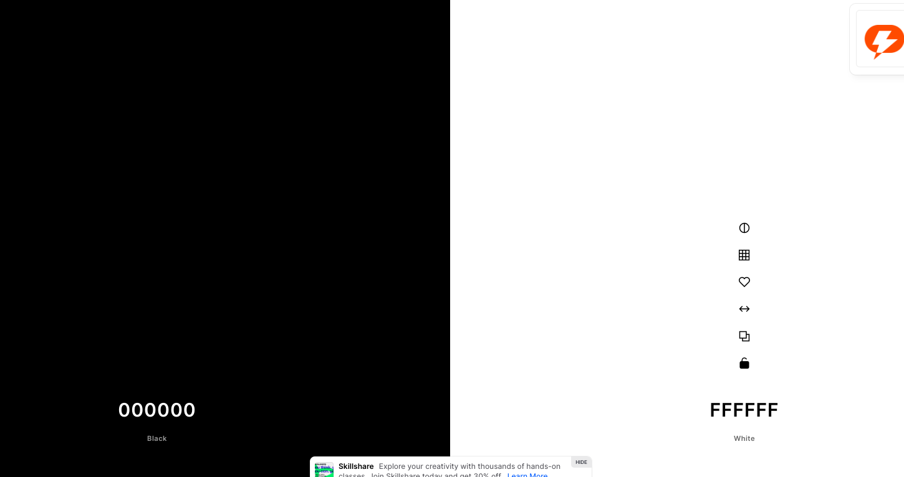

### Fonts

- For this Project "Lato" font was used from Google Fonts

##### Back to [top](#table-of-contents)

## Database
***

### Data Models

#### ER Diagram

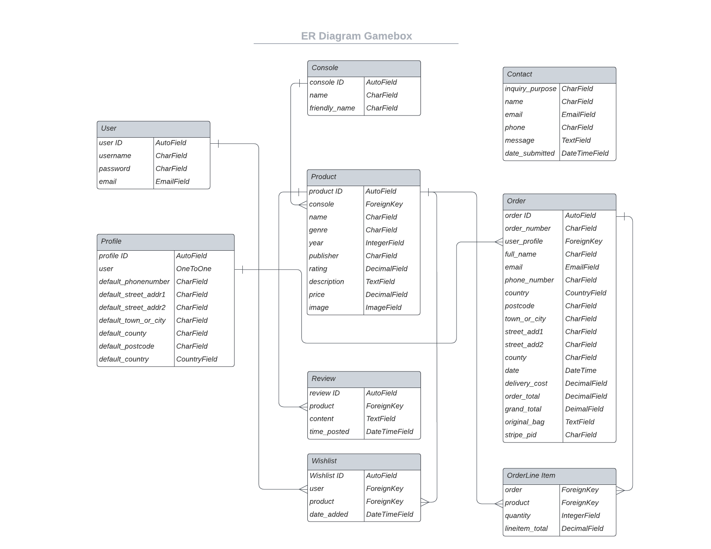

#### User model

- User model as part of the Django allauth library contains basic information about authenticated user and contains following fields:
username, password,email

####  Products model
- Product model made to represent webshop product containing all relevant fields giving user/customer information they need to make a desired purchase

| Name          | Field Type    | Validation |
| ------------- | ------------- | ---------- |
|console       | ForeignKey|  'Console', null=True, blank=True,on_delete=models.SET_NULL|
|name       | CharField|  max_length=254|
|genre       | CharField|  max_length=254|
|year       | IntegerField|  |
|publisher       | CharField|  max_length=254|
|rating       | DecimalField|  max_digits=6, decimal_places=2, null=True, blank=True|
|description       | TextField|  User|
|price       | DecimalField|  max_digits=6, decimal_places=2|
|image_url       | URLField|  max_length=1024, null=True, blank=True|
|image       | ImageField|  null=True, blank=True|

#### Console model
- Model made to clearly separate usage and desing of various webshop products
containing bellow stated fields

| Name          | Field Type    | Validation |
| ------------- | ------------- | ---------- |
|name       | CharField|  max_length=254|
|friendly_name       | CharField|  max_length=254, null=True, blank=True|

#### User Profile model

- Model representing an account of a registered user containing
following fields:

| Name          | Field Type    | Validation |
| ------------- | ------------- | ---------- |
|user       | OneToOneField|  User, on_delete=models.CASCADE|
|default_phone_number       | CharField|  max_length=20,null=True, blank=True|
|default_street_address1       | CharField|  max_length=80, null=True, blank=True|
|default_street_address2       | CharField|  max_length=80, null=True, blank=True|
|default_town_or_city       | CharField|  max_length=80, null=True, blank=True|
|default_county       | CharField|  max_length=80, null=True, blank=True|
|default_postcode       | CharField|  max_length=80, null=True, blank=True|
|default_country       | CountryField|  max_length=80, null=True, blank=True|

#### Order model

- Model storing information relevant to customer webshop order ,containing
fields:

| Name          | Field Type    | Validation |
| ------------- | ------------- | ---------- |
|order_number       | CharField|  max_length=32, null=False, editable=False|
|user_profile       | ForeignKey|  UserProfile,on_delete=models.SET_NULL,null=True,blank=True,related_name='orders'|
|full_name       | CharField|  max_length=50, null=False, blank=False|
|email       | EmailField|  max_length=254, null=False, blank=False|
|phone_number       | CharField|  max_length=20, null=False, blank=False|
|country       | CountryField|  blank_label='Country', null=False, blank=False|
|postcode       | CharField|  max_length=20, null=True, blank=True|
|town_or_city       | CharField|  max_length=40, null=False, blank=False|
|street_address1       | CharField|  max_length=80, null=False, blank=False|
|street_address2       | CharField|  max_length=80, null=True, blank=True|
|county       | OneToOneFCharFieldield|  max_length=80, null=True, blank=True|
|date       |     date = models.DateTimeField|  auto_now_add=True|
|delivery_cost       | DecimalField|  max_digits=6, decimal_places=2, null=False, default=0|
|order_total       | DecimalField|  max_digits=10, decimal_places=2, null=False, default=0|
|grand_total       | DecimalField|  max_digits=10, decimal_places=2, null=False, default=0|
|original_bag       | TextField|  null=False, blank=False, default=''|
|stripe_pid       | CharField|  max_length=254,null=False,blank=False,default=''|

#### Order Line Item model

- model representing single product in a user order

| Name          | Field Type    | Validation |
| ------------- | ------------- | ---------- |
|order       | ForeignKey|  Order,null=False,blank=False,on_delete=models.CASCADE,related_name='lineitems'|
|product       | ForeignKey|  Product, null=False, blank=False, on_delete=models.CASCADE|
|quantity       | IntegerField|  null=False, blank=False, default=0|
|lineitem_total       | DecimalField|  max_digits=6,decimal_places=2,null=False,blank=False,editable=False|

#### Contact model

- Model made with purpose of storing contact info between user and business with bellow stated fields:

| Name          | Field Type    | Validation |
| ------------- | ------------- | ---------- |
|inquiry_purpose       | CharField|  max_length=24, choices=INQUIRY_CHOICES|
|name       | CharField|  max_length=100|
|email       | EmailField|  max_length=100|
|phone       | CharField|  max_length=20, blank=True, null=True|
|message       | TextField|  max_length=1000|
|date_submmited       | DateTimeField|  auto_now_add=True|

#### Review model
| Name          | Field Type    | Validation |
| ------------- | ------------- | ---------- |
|author       | ForeignKey|  UserProfile,on_delete=models.SET_NULL, null=True, blank=True|
|product       | ForeignKey|  Product,on_delete=models.CASCADE,related_name='reviews'|
|content       | TextField|  max_length=1024|
|time_posted       | DateTimeField|  auto_now_add=True|

#### Wishlist model
| Name          | Field Type    | Validation |
| ------------- | ------------- | ---------- |
|user       | ForeignKey|  User,on_delete=models.CASCADE|
|product       | ForeignKey|  Product,on_delete=models.CASCADE|
|date_added       | DateTimeField|  auto_now_add=True|

### Wireframes

- Balsamiq was used for creating wirefrimes. During the development style and inital idea slightly changed to accomodate better user experience and design.

#### Homepage

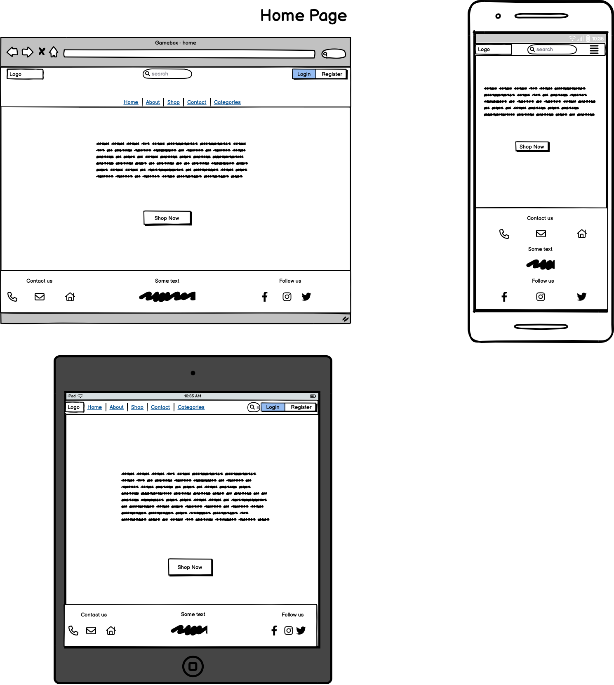

#### Products

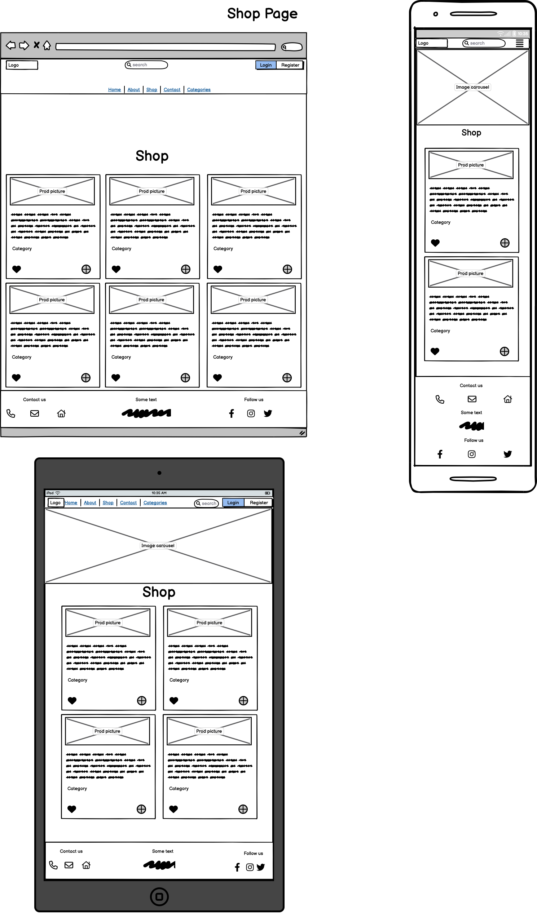

#### Product Details

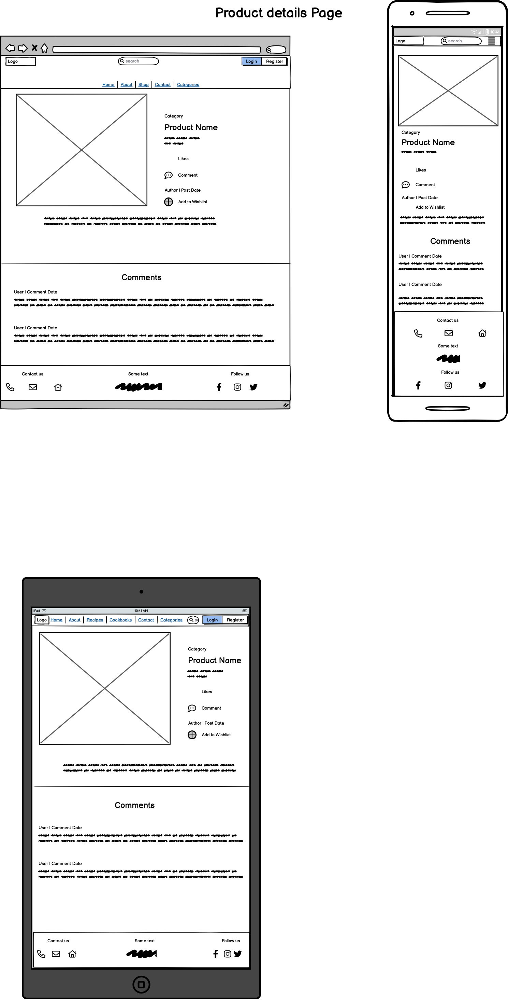

#### Contact Page

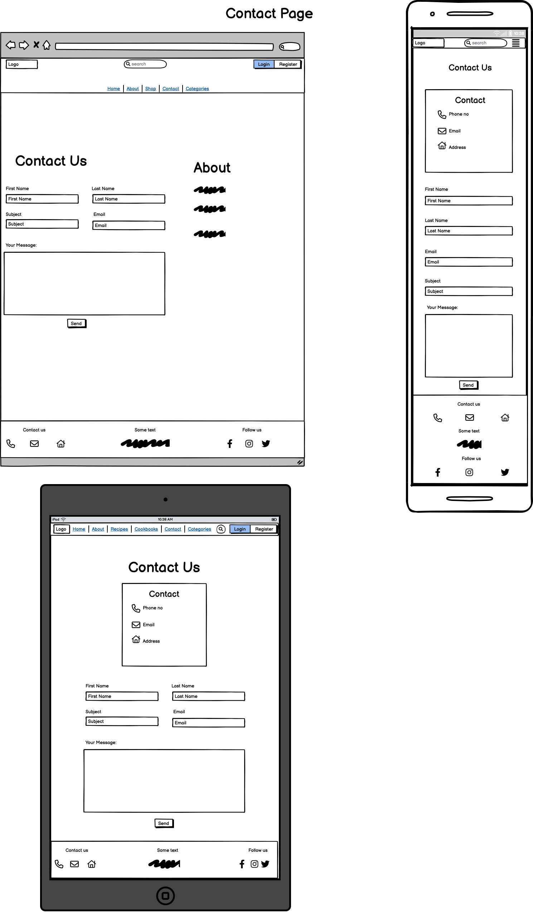

#### Search Results

## Technologies Used

### Languages & Frameworks

- HTML5
- CSS3
- JavaScript
- jQuery
- Python 3.10.2
- Django 3.2

### Libraries & Tools

- [Bootstrap 5.1](https://getbootstrap.com/). This project uses the Bootstrap library for UI components (Buttons, Card, Footer, Modal, Navbar)
- [AWS (Amazon Web Services)](https://aws.amazon.com/) was utilized in this project for hosting image files. An S3 bucket on AWS was created to store and serve the project's images, providing a reliable and scalable solution for managing and delivering the visual assets. With AWS, the project benefits from secure and efficient storage capabilities, ensuring seamless access to images throughout the application.
- [Stripe](https://stripe.com/) Stripe is integrated into the project to handle payment processing. It provides a secure and convenient way to handle online payments, including credit card transactions.
- [Balsamiq](https://balsamiq.com/) to create the projects wireframes
- [Am I Responsive](http://ami.responsivedesign.is/) was used for creating the multi-device mock-up at the top of this README.md file
- [dbdiagram.io](https://dbdiagram.io/home) for creating Entity relationship diagrams(ERD) of my project database
- [Favicon.io](https://favicon.io) for making the site favicon
- [Chrome dev tools](https://developers.google.com/web/tools/chrome-devtools/) was used for debugging of the code and checking site for responsiveness
- [Boostrap icons](https://fontawesome.com/) - Icons from Bootstrap icons  were used throughout the site
- [Git](https://git-scm.com/) was used for version control within VSCode to push the code to GitHub
- [GitHub](https://github.com/) was used as a remote repository to store project code
- [Google Fonts](https://fonts.google.com/) - for typography in project
- [Unspalsh](https://unsplash.com/)
- [Pexel](https://www.pexels.com/)
- [Lucidcharts](https://lucid.app/) 

##### Back to [top](#table-of-contents)
## Validation
***

### CSS

- [Jigsaw W3 Validator](https://jigsaw.w3.org/css-validator/)was used  to validate the css in the project

#### Base.css

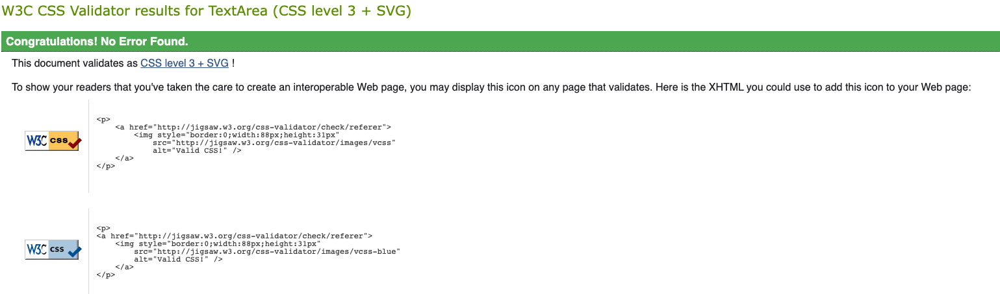

#### Profile.css

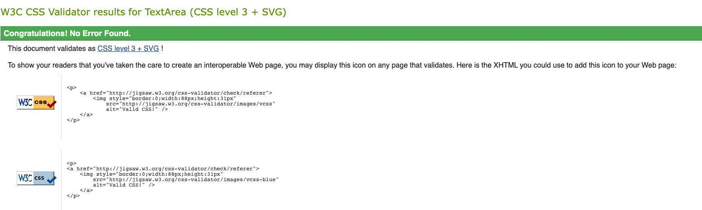

#### Checkout.css

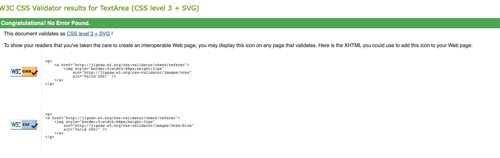

### Html

-  [WC3 Validator](https://validator.w3.org/) was used for the validation of projects html code

#### Home

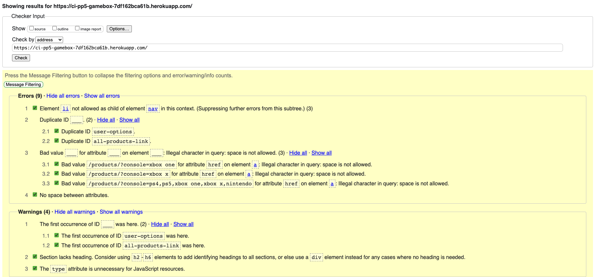

#### Products

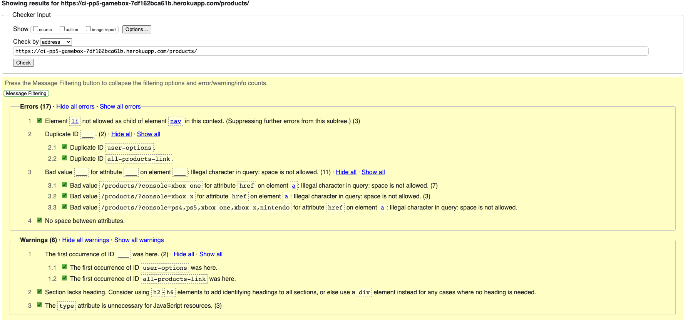

#### Product Details

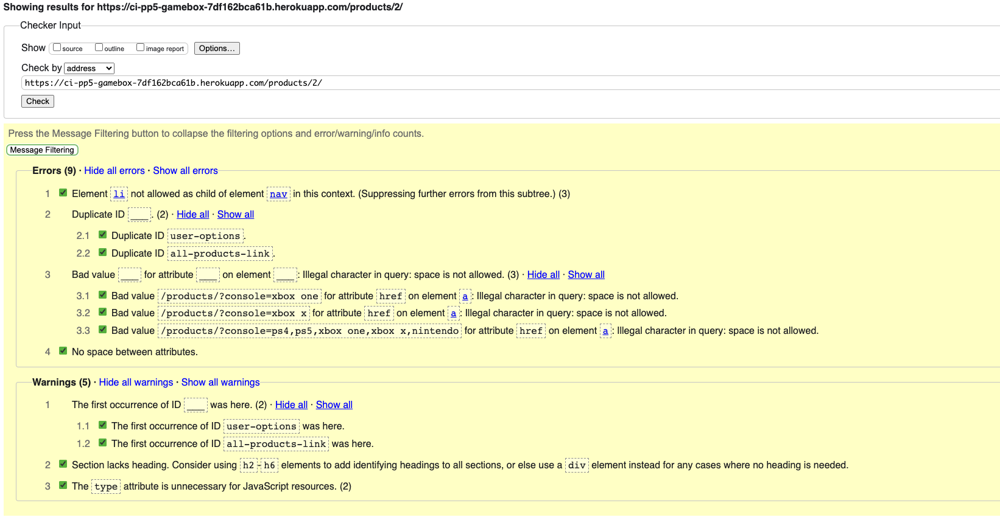

#### Contact

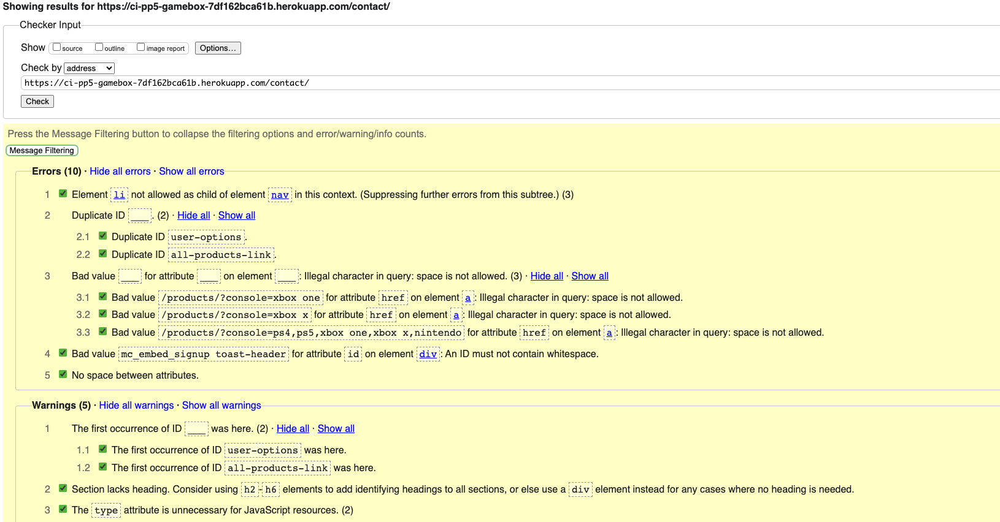

#### Profile

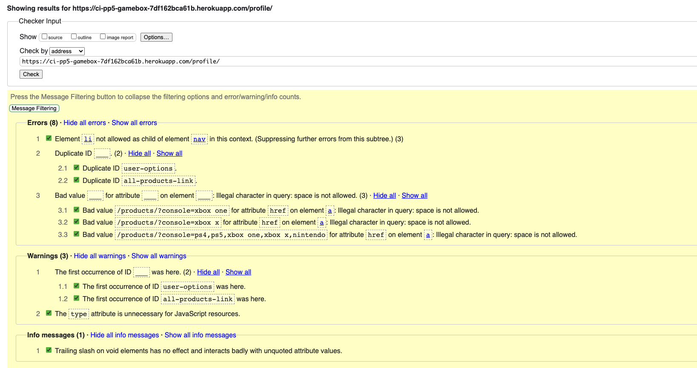

#### Wishlist

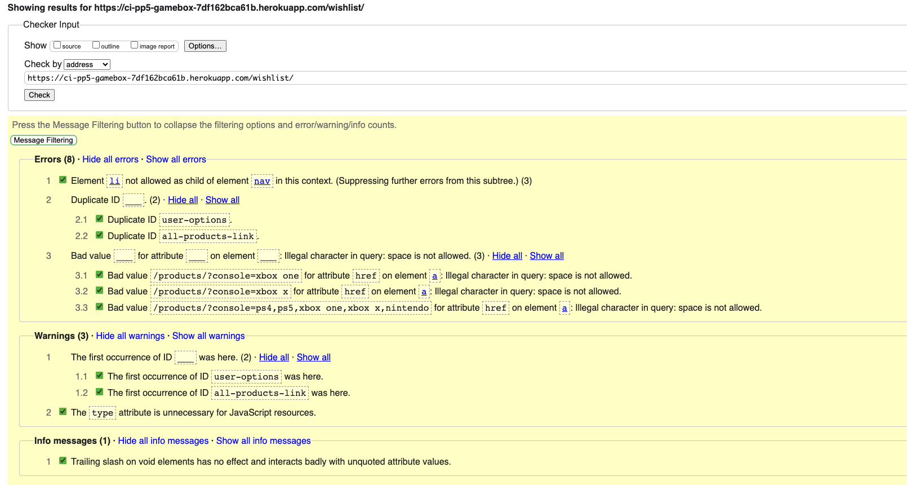

### Javascript

### Python

### Lighthouse

#### Homepage

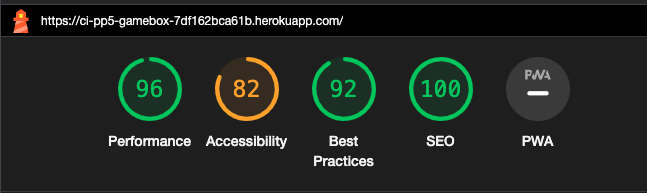

#### Products page

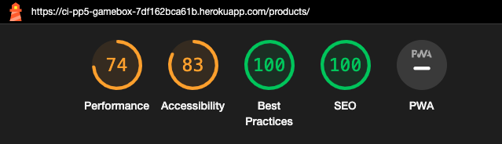

#### Product Detail

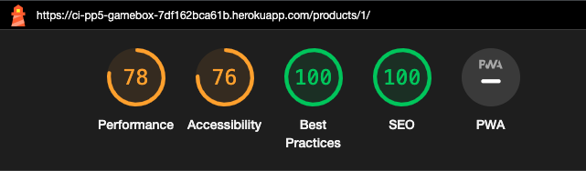

#### Contact Page

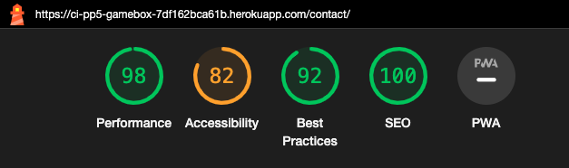

#### Profile page

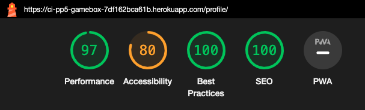

#### Shopping Bag

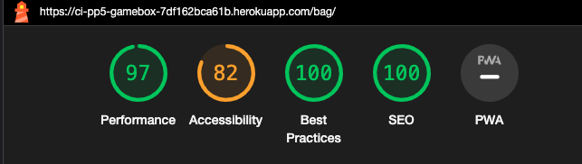

#### Wishlist

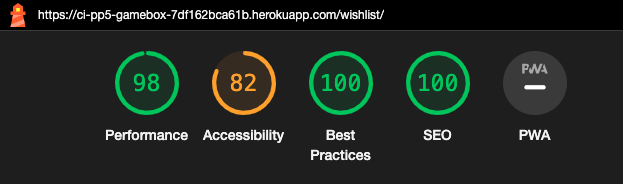

#### Checkout

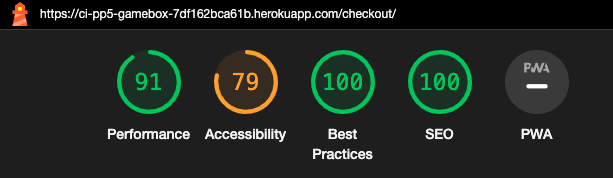

##### Back to [top](#table-of-contents)

## Deployment

- During the initial phases of development, Hungry Chef was deployed on Heroku. To avoid any potential deployment issues near the app's release, I made sure that the database and static files were accessible right from the start of the project.

###  Creating Database ==> ElephantSQL
1. To generate a managed PostgreSQL database, please proceed to [ElephantSQL](https://customer.elephantsql.com/) and either sign up or sign in to your account. Once you've logged in, click on the 'Create New Instance' button.

2. Name your database and select the 'Tiny Turtle' payment plan. Then, click on 'Select Region'

3. Select your preferred region and create the database instance.
    After creating the instance, navigate to the instances page and click on the name of the database you selected earlier. Then, in the details section on the following page, copy the PostgreSQL URL.

### Heroku Deployment

- Before deploying to Heroku there are a few things to have ready
ElephantSQL Database url, SECRET_KEY variable(generate key different from provided one), CLOUDINARY_URL variable(after logging in the Cloudinary website copy the 'cloudinary url' from your account dashboard as the value of a variable )
- Create env.py (at the root level of your project) This file contains the above mentioned
variables in a form of:
- os.environ['DATABASE_URL'] = 'value of ElephantSQL Database url'

- os.environ['SECRET_KEY'] = 'value of secret key'
    secret key could be generated [here](https://miniwebtool.com/django-secret-key-generator/)

-  os.environ['CLOUDINARY_URL'] = 'value of 'cloudinary url' from your  
   account dashboard'
   cloudinary url can be found [here](https://console.cloudinary.com/)

1. First, sign up or sign in to your Heroku account. Next, create a new app from the Heroku dashboard.

2. Choose a unique name for your app and enter the region.Then, click on the 
    'Create App' button.
    Once your app has been created, select the 'Settings' tab from the dashboard and navigate to 'Reveal Config Vars'. From there, paste the: 
    - ElephantSQL Database URL into the DATABASE_URL environment variable.
    - SECRET_KEY variable  into the SECRET_KEY environment variable.
    - CLOUDINARY_URL variable  into the CLOUDINARY_URL environment variable.
    - add DISABLE_COLLECTSTATIC variablewith value of 1 (for initial deployment, later this variable can be removed)
    - add variable named PORT with value of 8000

3. Select Deploy option from the 'tabs'

4. From Deployment method section choose Connect to GitHub and click on it

5. Find your github repository by name and connect

6. At the bottom of the page choose either automatic deployment manual 
   deployment(deploy by branch)

7. Click on the option you want, and you should be able to see the boiler process.
    and after a while, your app should be deployed.

### Forking the GitHub Repository

1. Login or Signup to [Github](https://github.com/)
2. Navigate to  the GitHub repository link  https://github.com/Carvu94/CI-PP5-gamebox
2. Click on the Fork button in the top right corner

3. Copy of the repository will be in your own GitHub account.

### Clone a GitHub Repo

1. Go to the GitHub repository  https://github.com/Carvu94/CI-PP5-gamebox
2. Locate the Code button above the list of files (next to 'Add file') and click it

3. choose a preferred cloning option by selecting either HTTPS or GitHub CLI.
4. Open Git Bash
5. Change the current working directory to the one where you want the cloned directory
6. Type git clone and paste the URL from the clipboard ($ git clone https://github.com/YOUR-USERNAME/YOUR-REPOSITORY)
7. Press Enter to create your local clone

[Back to Table Of Contents](#table-of-contents)

## Credits

### Code

- [Glassmorphism](https://hype4.academy/tools/glassmorphism-generator) 
- [Stack Overflow](https://stackoverflow.com/)
- Code Institute Walkthrough Projects

### Tutorials

   - [Codemy.com](https://www.youtube.com/watch?v=B40bteAMM_M&list=PLCC34OHNcOtr025c1kHSPrnP18YPB-NFi)
   - Code Institute Walkthrough Projects

## Acknowledgements

- Special Thanks to my mentor
- Thanks to my girlfriend, family and friends for support
- Thanks to Code Institute and fellow students on Slack channels

[Back to Table Of Contents](#table-of-contents)
